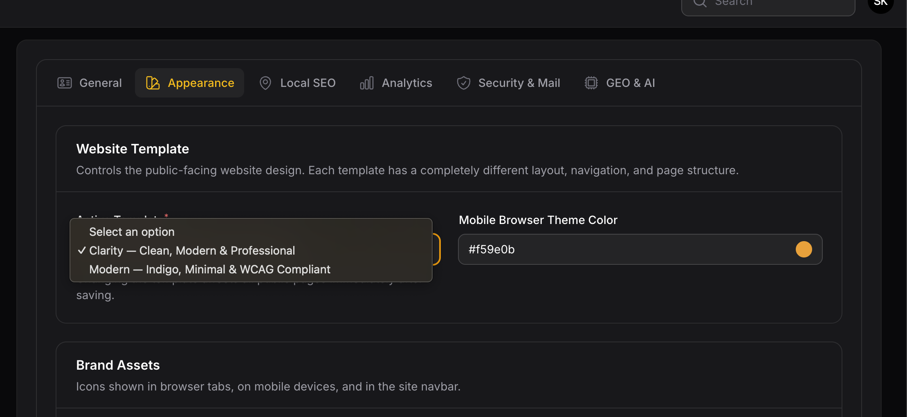
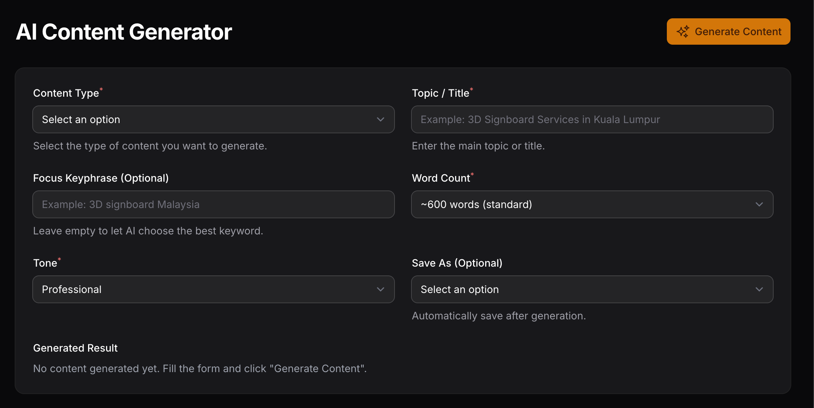
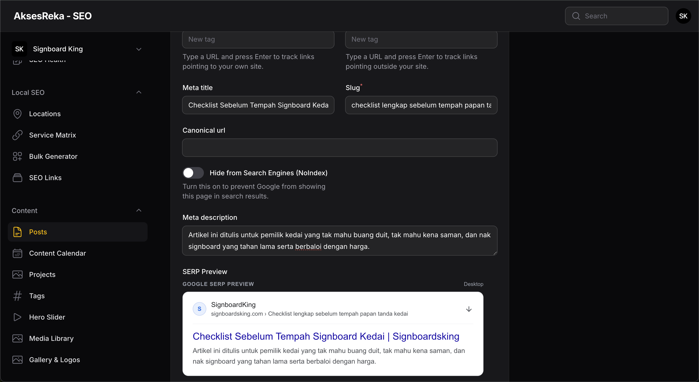
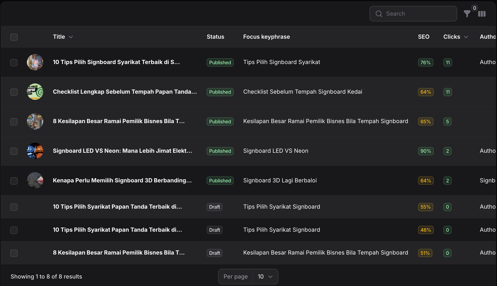
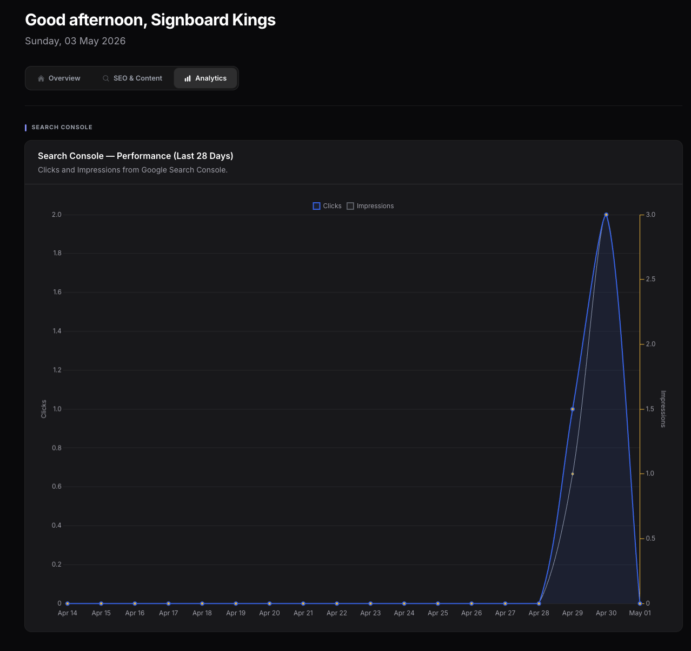

# Akses SEO Platform v2

> Multi-tenant SEO management platform built for signboard & local business clients in Malaysia.


---

## Overview

Akses SEO Platform v2 is a white-label, multi-tenant admin panel that allows an agency (owner) to manage multiple clients and their websites from a single installation. Each client gets isolated access to their own content, SEO settings, and analytics — with zero cross-tenant data leakage.

Built on Laravel 13 + Filament v5, deployed on shared hosting at Hostinger.

---

## Key Features

### Multi-Tenancy
- 3-tier hierarchy: **Owner → Client → Site**
- Per-site data isolation via global `TenantScope` on all 18 content models
- Role system: `owner`, `client_owner`, `editor` with Spatie Permission v7.3
- 150 granular permissions across 15 resources
- IDOR protection via `VerifiesTenantOwnership` policy trait
- Atomic quota enforcement via `QuotaService` (DB-level locks)
- Server-side role enforcement — `client_owner` is locked to their own client regardless of form input

### Content Management
- Posts, Services, Service Locations, Products, Projects, Locations
- Tags, Categories, Media Library (with auto-metadata extraction)
- Hero Slider, Redirects Manager, Broken Links checker
- **AI Content Generator** — GPT-powered English SEO content drafts with tone and keyphrase targeting

### Public Templates
- **2 complete themes**: Clarity (Nunito, orange accent) and Modern (Inter, indigo palette)
- Live template switching per site from the admin panel
- All 15+ public pages designed for local business SEO (services, locations, portfolio, contact)
- Schema.org JSON-LD on every page type (LocalBusiness, BlogPosting, Service, FAQPage, HowTo)

### SEO Tooling
- **Live SERP Preview** — reactive Google-like preview inside every editor (Alpine.js + Livewire `entangle`) with character counters and amber/red overflow warnings
- **Focus Keyphrase Analyzer** — density check, prominence score, readability hints
- **SEO Score** — per-post scoring (title, meta, keyphrase, readability, schema, AEO, GEO)
- **Internal Link Suggestions** — auto-queries related content by shared tags + keyphrase overlap
- **Schema.org Generator** — Article, LocalBusiness, Product, Service, FAQPage
- **Bulk Service × Location Generator** — generates city-targeted service pages at scale
- **SEO Content Calendar** — month-view content calendar with color-coded post pipeline

### AEO & GEO (AI-Era SEO)
- FAQ Repeater on all content types → FAQPage JSON-LD
- `/llms.txt` generator with site info, key pages, AI policy
- Opt-out controls for 14 AI training crawlers via `robots.txt`

### Google Search Console
- Full GSC API integration (site-level OAuth credentials)
- Performance metrics surfaced directly in the Post form (clicks, impressions, CTR, position)
- Top queries widget on dashboard

### Security
- TOTP 2FA (full implementation)
- CSP + HSTS middleware (`SecurityHeaders`)
- Honeypot on public forms
- Input sanitization (`SanitizesSeoFields`)
- Safe redirect validation (`SafeRedirectUrl`) with tenant-scoped destination enforcement
- Activity logging on 9 models with per-site isolation
- Global FileUpload MIME validation
- Permissions-Policy header (camera, microphone, geolocation all blocked)
- Login rate limiting via Filament's built-in `WithRateLimiting`

### Branding & Appearance
- Navbar logo upload — replaces site name text with a custom image per site
- 4 theme palettes with live preview (`ThemeService` singleton + CSS vars)
- Sitemap (7 sub-sitemaps: posts, services, products, projects, locations, service-locations, tags)
- 3-step setup wizard (admin path, credentials, site identity)

---

## Architecture Highlights

```
app/
├── Models/         18 content + settings models, all TenantAware
├── Policies/       12 resource policies with VerifiesTenantOwnership
├── Services/
│   ├── QuotaService            Atomic DB-lock quota enforcement
│   ├── TenantContext           Singleton for safe job/command tenant access
│   ├── RoleAssignmentService   Role promotion rules
│   ├── SeoScoreService         Per-post + homepage SEO scoring
│   ├── SchemaService           Schema.org JSON-LD generator
│   ├── AiContentService        GPT-powered content generation
│   └── GoogleSearchConsoleService  GSC API wrapper
├── Http/Middleware/
│   ├── DetectSiteFromDomain    Resolves tenant from public domain
│   └── SecurityHeaders         CSP, HSTS, X-Frame, Referrer, Permissions-Policy
└── Filament/
    ├── Resources/  18 resources (Owner/ClientOwner/Editor scoped)
    └── Pages/      SEO Hub, Content Calendar, Bulk Generator, GSC, Appearance, Setup
```

---

## Tech Stack

| Layer | Technology |
|-------|-----------|
| Backend | Laravel 13, PHP 8.4 |
| Admin Panel | Filament v5 |
| Database | MySQL 8 |
| Frontend Build | Vite |
| Auth / Roles | Laravel Sanctum + Spatie Permission v7.3 |
| SEO Data | Google Search Console API, Spatie Sitemap |
| Activity Log | Spatie ActivityLog |
| AI Content | OpenAI GPT API |

---

## Screenshots

### Dashboard — Site Health & Content Pipeline


### Multi-Site Management


### Public Template Switch


### AI Content Generator


### Live SERP Preview (In-Editor)


### Post List with SEO Score


### Analytics — Google Search Console Integration


### SEO Content Calendar


### Lighthouse Scores (Client Site)


---

## Source Code

This repository is **private**. The source code is available on request for potential employers or collaborators.

Contact: [aksesreka@gmail.com](mailto:aksesreka@gmail.com)
